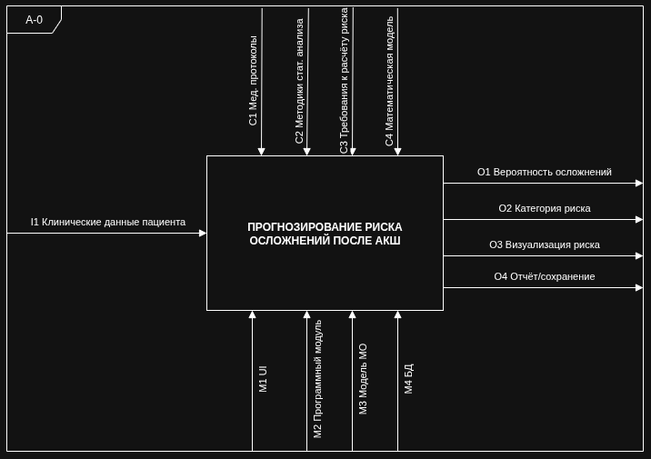
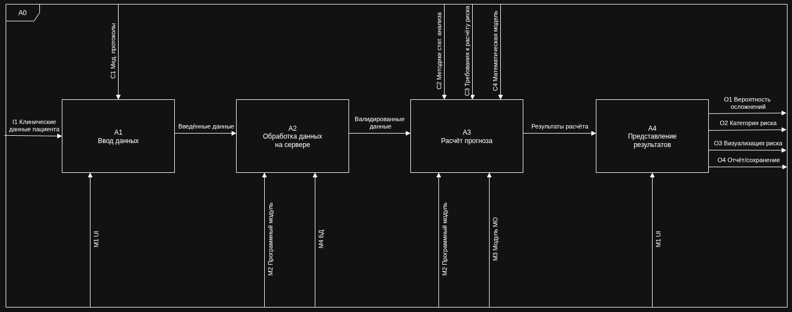
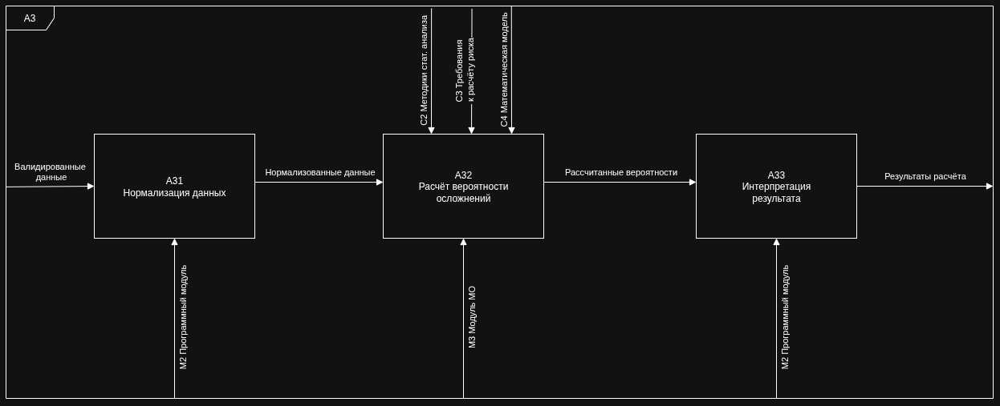

# Архитектура системы

## Обзор

Система построена на микросервисной архитектуре с четырьмя независимыми компонентами, каждый из которых отвечает за свою зону ответственности и взаимодействует с другими через REST API.

## IDEF0-диаграммы

### A-0: Контекстная диаграмма

**Верхний уровень системы.** Показывает основной поток: на вход подаются клинические данные пациента, система выполняет прогнозирование рисков, на выходе — оценка риска и рекомендации.

| Вход | Механизм | Управление | Выход |
|------|----------|------------|-------|
| Клинические данные (пол, возраст, вес, креатинин, ФВ ЛЖ, сопутствующие заболевания...) | ML-модель + калькуляторы шкал | Медицинские стандарты, валидация данных | Оценка риска (низкий/средний/высокий), вероятности по целям |

---

### A0: Декомпозиция верхнего уровня

**Система разбивается на три функциональных блока:**

1. **Подготовка данных** — приём и валидация клинических показателей
2. **Расчёт метрик** — вычисление промежуточных шкал (EuroSCORE II, CCI)
3. **Прогнозирование** — ML-модель выдаёт финальную оценку риска

---

### A3: Декомпозиция блока прогнозирования

**Детализация ML-пайплайна:**

- Предобработка признаков (нормализация, кодирование категорий)
- Расчёт промежуточных метрик через Calc Service
- Мердж сырых фич и рассчитанных метрик
- Прогон через ансамбль моделей (CatBoost + TabNet)
- Формирование финального результата: `risk_score` + `risk_level`

---

## Схема потоков данных (Data Flow)

### Два режима работы

| Режим | Путь | Особенности |
|-------|------|-------------|
| **UI (для врача)** | Браузер → Backend (`/predictions/ui/*`) → Calc → ML → Backend → БД | Поддерживает background-задачи, polling, кэширование, сохранение в БД |
| **API (для интеграций)** | Внешняя система → Backend (`/predictions/predict`) → Calc → ML → ответ | Синхронный, без сохранения, без UI-обвязки |

---

## Сервисы и зоны ответственности

| Сервис | Порт | Назначение |
|--------|------|------------|
| **Frontend** | 5173 (dev) / статика через Nginx | SPA на React + TypeScript, динамические формы, отображение результатов |
| **Backend** | 8000 | Оркестратор: валидация, маршрутизация, сохранение в БД, кэширование |
| **Calc Service** | 8001 | Расчёт клинических шкал (EuroSCORE II, CCI) по сырым данным |
| **ML Service** | 8002 | Инференс ML-моделей, получение списка фич, reload модели на лету |
| **PostgreSQL** | 5432 | Хранение пациентов, операций, предиктов, клинических данных |
| **Nginx** | 80/443 | Обратный прокси, раздача статики, SSL-терминация |