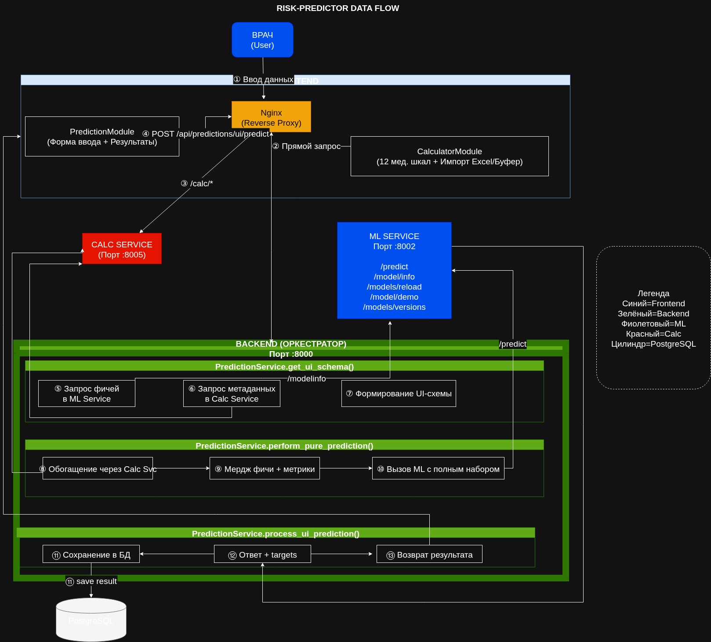

# Стек технологий

Проект построен на микросервисной архитектуре с разделением ответственности между независимыми компонентами.

## Backend (API Gateway)
| Компонент | Технология | Версия |
|-----------|------------|--------|
| Фреймворк | FastAPI | 0.109.0 |
| ASGI-сервер | Uvicorn | 0.27.0 |
| ORM | SQLAlchemy | 2.0.23 |
| Миграции | Alembic | 1.13.1 |
| Валидация | Pydantic | 2.5.3 |
| Конфигурация | pydantic-settings | 2.1.0 |
| HTTP-клиент | httpx | 0.26.0 |

## ML Service
| Компонент | Технология | Версия |
|-----------|------------|--------|
| Фреймворк | FastAPI | 0.109.0 |
| Основная модель | CatBoost | 1.2.10 |
| Альтернативная модель | PyTorch TabNet | 4.1.0 |
| Базовые алгоритмы | scikit-learn | 1.8.0 |
| Обработка данных | pandas / numpy | 2.1.4 / 1.26.3 |
| Сериализация | joblib | 1.3.2 |

## Calc Service (Калькуляторы шкал)
| Компонент | Технология | Версия |
|-----------|------------|--------|
| Фреймворк | FastAPI | 0.109.0 |
| ASGI-сервер | Uvicorn | 0.27.0 |

## Frontend
| Компонент | Технология |
|-----------|------------|
| Язык | TypeScript |
| UI-библиотека | React |
| Сборщик | Vite |
| Стилизация | Tailwind CSS (cn-утилита) |

## Инфраструктура
| Компонент | Технология |
|-----------|------------|
| Контейнеризация | Docker + docker compose |
| База данных | PostgreSQL |
| Обратный прокси | Nginx |
| CI/CD | GitHub Actions |

---

## Схема взаимодействия (Data Flow)

*Внешние запросы приходят на Nginx → Backend проксирует ML-запросы в ML Service, калькуляции — в Calc Service. Результаты кэшируются в PostgreSQL.*